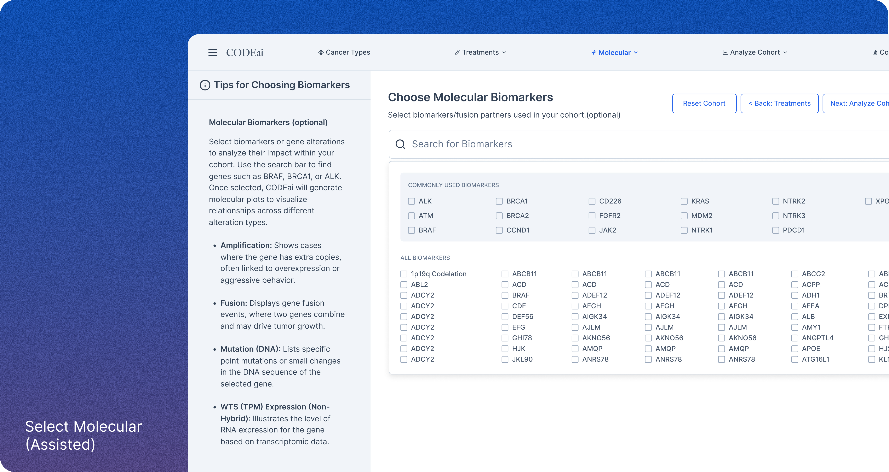
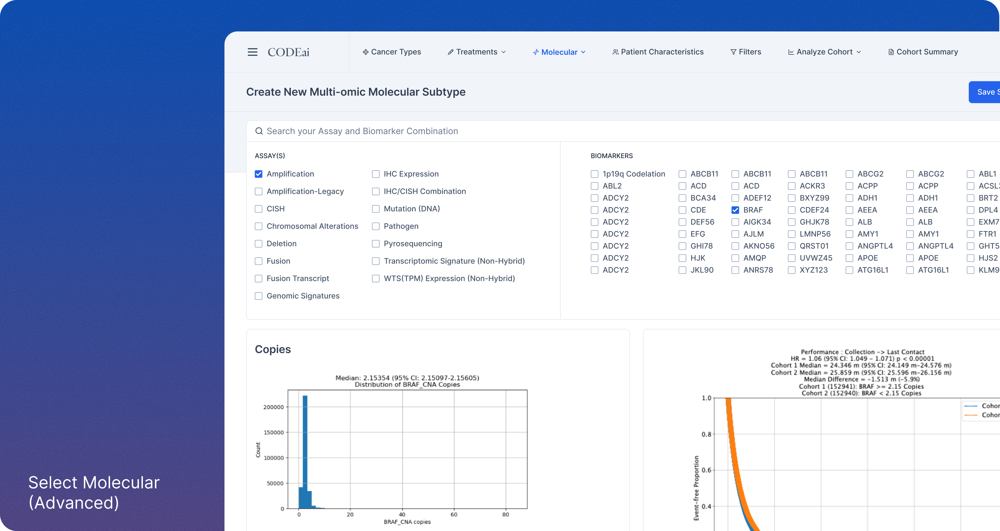
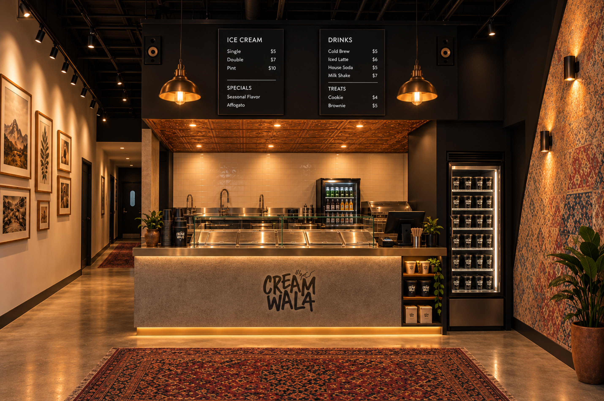
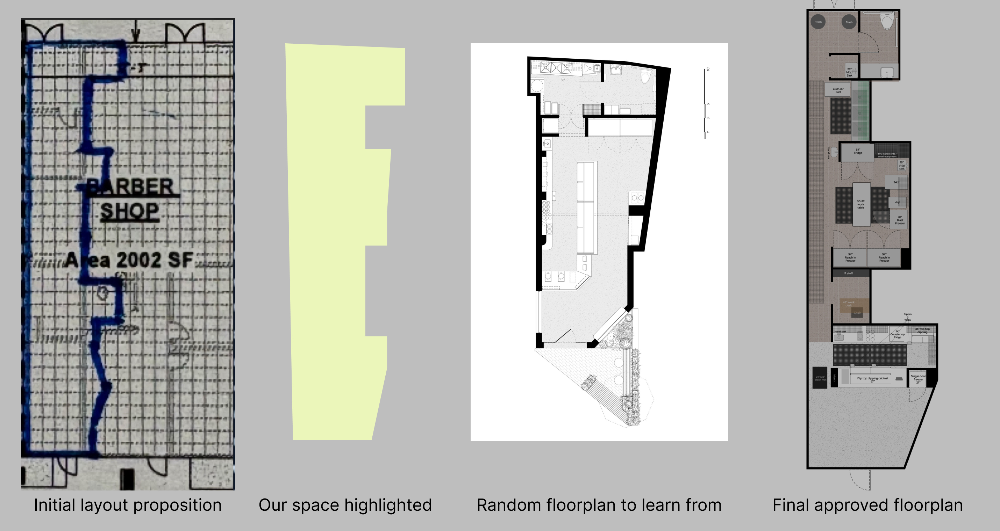
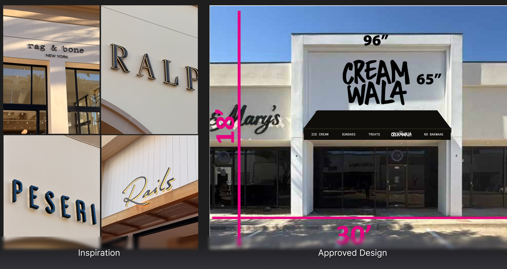
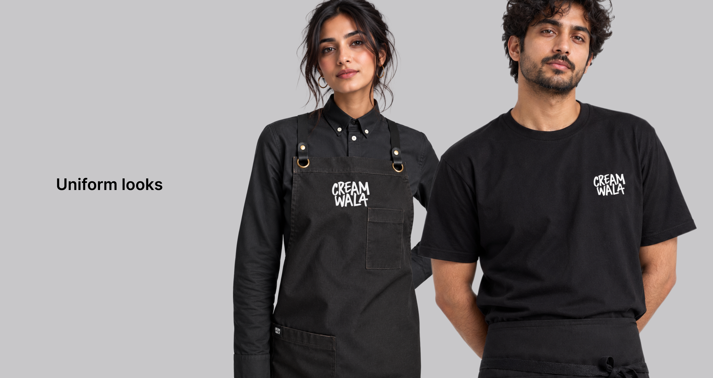

# **Allie**

*Turning an internal AI tool into a product clients would buy*

### **Overview**

Allata built Allie (originally called AllataBot) as an internal developer tool built with stock Shadcn components. Upon realizing its value, leadership decided to sell it to clients as an AI accelerator. It runs Claude, Gemini, OpenAI and Grok models inside the client's own environment and gets white-labeled to match each client's brand and knowledge base. I led the UX and UI redesign for this desktop-first (for now) product and rebuilt the entire app from the ground up with a customized component library. Along the way, I learned how the role of design and development has evolved. The job was to make a product that potential clients wanted to buy.

### **Problem**

AllataBot itself worked fine, but it was clearly a template. It diminished Allata's credibility when this was positioned as its pitch for design and engineering capabilities. The original files used around 14 colors at varying opacities for a single hierarchy, so nothing could be tokenized and contrast shifted with whatever sat behind it. Dark-mode links failed WCAG outright and developers were hard-coding hex values. There was no system to build from.

### **Research**

I audited every color in both light and dark modes against contrast standards, which turned something purely “aesthetic” into a measurable accessibility problem. I studied Claude, Perplexity and app screens across Mobbin for AI chatbot standards, progressive disclosure and dense chat data in a narrow column, then tested concepts against screenshots of the running build. The recurring finding was vocabulary. Allata was using arbitrary, non-standard jargon to name its features and products, which meant little to new users and likely confused them.

### **Building the design system**

The standard move would have been a reskin. I replaced opacity-based hierarchy with a solid neutral ramp and restructured the palette into semantic tokens, so light and dark resolve from the same names and every pairing is checked against contrast standards. I built a type system and a component library curated down from Shad-CN Pro and the Elements AI library to only the variants we needed. Because every color is a token, dropping in a client's brand colors and standards doesn't break anything. That's what makes white-labeling work.

### **Making the case to leadership**

Leadership wanted to fix the product “aesthetically,” but I kept advocating for proper design principles and made the case that taking the time to refine a cohesive system now would make everyone's job easier later. That meant creating a codified design system AI agents could build from, helping developers build new features, and making it easier for the team to re-theme the app for each client. It also helped us establish a new process for how AI fits into the design-to-development workflow.

### **Designing with AI in the loop**

I used the Figma MCP integration to let an AI agent build screens on the canvas from my curated library, pulling real component instances instead of lookalikes. Refinement was slow, and it had no instinct for a mismatched shadow or a link color that can't work in both themes. The agent was only as good as the system I handed it.

### **Working across disciplines**

Working across disciplines meant partnering with leadership, product and developers to establish a shared standard for how AI could fit into our workflows. I worked with developers to make sure the components matched the design system and that the underlying flow logic held together. I also QA'd builds with teams in India and Argentina, logging defects page by page in ADO and explaining the intent behind each decision so the team could apply it to the next screen. The process became a way to learn together, not just a list of fixes.

### **Impact**

Allie now has a deliberate identity, accessibility that passes across the board, and a white-label feature that clients can brand as their own. We also created and refined the Product-to-Design-to-Web process with an AI agent layer built into it. This will be used as the standard going forward for all new features.

### **Retrospective**

I pushed to rename jargon like Persona, Skill, Extension and Data Product into language non-technical users would recognize, but leadership asked me to hold those changes for V1. I lost that one. So I focused on explainer copy that gives users enough context to learn what each term means instead of guessing.

The bigger lesson is that a design system is worth the time it takes to do right, and advocating for that time is part of the job. Every phase after it moves faster.

# ---

**Caris Life Sciences: CODEai**

*Redesigning cohort analysis for researchers and clinicians*

### **Overview**

CODEai is Caris Life Sciences' real-world clinico-genomic data platform, combining large-scale molecular data with treatment and outcome information to support research, clinical decisions and drug development. Caris wanted to open it up to biopharma, research partners and internal clinical teams. As UX lead, I redesigned the cohort analysis and visualization flows. The goal was a tool that's easy to use without losing its analytical power.

### **Problem**

The interface was cluttered and dated, with inconsistent controls, unclear flows and a steep learning curve that hit new users and non-technical clinicians hardest. It gave users zero guidance, so they fell back on manual workarounds. Users also lacked a clear mental model of how the platform structured its data. That made it hard to know where to start.

### **Research**

Stakeholders had already interviewed the two main user groups, researchers and clinicians, before I joined. A data scientist said, "I spend too much time scrolling to find the right biomarkers and assays. Search is not intuitive and half the time doesn't even work." A clinician said, "I actually had no idea on how to begin or what to do. I can't explain what it's lacking but it's just not clear on what I need to do." Those two quotes describe two different users with two different problems. One needed speed and control, the other needed a starting point.

### **The strategic call: two modes**

The original ask was a visual refresh, making CODEai look "slick and pretty." I pushed for a structural change instead: an Assisted mode that walks users through building a cohort step by step, and an Advanced mode that gives power users full control. That shifted the project from a visual refresh to a redesign of how people build cohorts. Neither group had to compromise for the other.

### **Execution**

I designed a cohesive architecture for filters, results, visualizations and export workflows. I optimized the key flows, including cohort creation, building custom therapies and fast switching between modes, to cut friction and error risk. A tips panel gives clinicians and researchers guidance right where they need it. The visual layer got a modern treatment, with better typography, a clear color hierarchy and responsive layouts that match the brand's premium positioning.

### **Retrospective**

I worked with clinicians, product managers and engineers who were open-minded and collaborative, on a tool that matters to cancer research. Stakeholder alignment was clear, the research foundation was strong, and prototype-to-test iterations moved fast.

What I'd change is how close I got to users. I relied on a stakeholder as an intermediary instead of hearing from users firsthand, and that direct connection would have surfaced subtler mental models and pain points earlier. Next time, I'd be in the room.

# ---

**Redfin: Change Orders**

*Bringing a scattered, manual workflow into one system*

### **Overview**

Change orders, meaning any amendment to the original renovation contract, happened on about 73% of Redfin Home Services jobs, and each one affected timelines, budgets and team coordination. Despite that, the process was manual, spread across platforms and invisible to most of the people it affected. As Lead Product Designer, I designed a centralized change order system inside Builder Tools, Redfin's internal platform. The goal was end-to-end visibility for everyone in the renovation lifecycle.

### **Problem**

Requests came in through Slack, email, phone calls and Zendesk, so nobody could track who asked for what, when or why. Field teams couldn't see the real-time status of approvals, which led to higher costs and schedule delays. The business couldn't see why changes were happening either, so it couldn't act on the main lever for shortening renovation timelines. Nobody had the full picture.

### **Designing for five roles**

Renovation is a team sport, and this system had to work for five roles. Listing Concierges initiate changes, Market Managers price them and requisition the work, and Estimators break down costs and generate the DocuSign for the seller. Superintendents in the field need to see the current scope to manage vendors, and Payment Coordinators need a clear audit trail of taxable and non-taxable changes. Each role needed something different from the same data.

### **Research**

We interviewed 24 employees across Home Services, Concierge and RedfinNow, and I shadowed crews at active renovation sites to see the offline hurdles firsthand. In FigJam, I ran journey-mapping sessions where users laid out their ideal workflow against their actual one, which pinpointed where communication broke down. I also reviewed the legal Change Order and Scope of Work forms so the digital version would stay compliant with state and local tax requirements.

Four findings shaped the design. Change orders were the most disruptive part of any schedule, users couldn't tell original scope from later additions, payment teams were calculating taxes and totals by hand, and there was no way to see what stage a change order was in. Each one became a feature.

### **Execution**

I started with paper sketches and Procreate wireframes on the iPad, exploring layouts like the Estimate tab before committing to UI. Next, I designed a state machine for the job lifecycle, with statuses like Building Change Order, New Change Order Request and Requisition CO Work that lock and unlock service items automatically. In Figma, I added a Version column to the Estimate tab that labels each item as Initial SOW or Change Order \#01. That gave the team the audit trail they'd been missing.

The final system also included:

> * A persistent banner that tells users when they're in Building mode, so no one edits by accident.  
> * Read-only service items once a change order is submitted, protecting data while the estimator processes it.  
> * A history feed that logs every change, from a unit price update to the reason behind a client request.  
> * A standardized table that calculates taxable and non-taxable subtotals, taking manual math off the Payments team.

### **Retrospective**

The national rollout saw immediate adoption, and many users didn't need formal training because they simply followed the status triggers. RedfinNow had its own design team, so we piloted change orders with our team first before they'd adopt it, and I built the system with versioning in mind to make that handoff possible. I left Redfin before that rollout, so I can't speak to how it landed. The project also exposed how few shared components our internal tools had, which pushed teams toward a more collaborative design environment. The status triggers did the training for us.

# ---

**Creamwala**

### **Introduction**

Creamwala is a Pakistani-American ice cream company redefining what cultural food brands can be. Our goal was to create a premium, small-batch ice cream that feels familiar yet completely new. Celebrating Pakistani flavors through a modern, design-driven lens and flawless execution. Every flavor tells a story that connects nostalgia with creativity amongst the Pakistani-American diaspora in the most authentic way possible.

### **Problem**

Too often, Pakistani identity is diluted or misrepresented under broader South Asian or Bollywood-inspired tropes and visuals. I wanted Creamwala to be unapologetically Pakistani, drawing from the Pakistani-American diaspora's shared experiences, our music, humor, and language, and to present it with the same design sophistication and product quality as any high-end American brand.

### **Research**

I analyzed direct competitors and broader cultural brands, studying how they told stories, priced products, and built communities. I took a bold but calculated risk by launching Creamwala without relying on market-tested messaging. Instead, I leaned into instinct, culture, and the community's pulse to see if authenticity and boldness would resonate.

It absolutely did.

### **Execution**

Creamwala is a rejection of safe, expected ethnic branding. Instead of bold colors and floral motifs, I leaned into a rebellious, grunge-influenced design language that draws from underground zines, music posters, and late-night memories from when I visited Karachi.

From copywriting and art direction to packaging and merch, I led the creative vision to feel specific, intentional, and emotionally honest. Every flavor name and flavor description, from Pagal Pista, to Mango Masti, or Biscoff Baddie, was written with just enough mischief to make you smile if you get it. I didn't water it down nor did I provide long explanations. No "fusion" disclaimers. I just focused on clever storytelling that resonates with our people.

### **Retrospective**

In our first 12 months, Creamwala grew from idea to a six-figure brand (what?) without VC, PR, or a storefront. Yet. Purely on Instagram and word-of-mouth.

We built a loyal audience across North Texas and beyond with our killer social media, amazing product, and uncompromising customer service. We started with selling out limited runs of our pints, and now expanding into wholesale partnerships with other local brands across DFW.

More than revenue, the most validating outcome is how often people say: "It finally feels like something made for us."

### **What's Next: The Flagship**

Creamwala's first brick-and-mortar scoop shop opens in Richardson in November/December 2026, if there are no hiccups. It's about 830 square feet, split roughly half back-of-house and half front-of-house, with hours built around our late-night peak. Going from events and wholesale to a physical space meant learning a set of disciplines I'd never touched before.

**MEPs and construction**

Mechanical, electrical and plumbing drawings were completely new territory for me. Before anything could be drawn, we had to gather every piece of equipment we'd be using and check it against Richardson's city requirements for a new kitchen build: a 3-compartment sink, a mop sink, a prep sink, and a hand wash sink within 25 feet. When our MEP engineer/architect went unresponsive, I designed the layout entirely myself. That initial work really helped us, because we'd never worked with a commercial general contractor before, and our MEPs are what got construction started.

**Signage and the logo update**

The original logo paired CREAMWALA with its Urdu equivalent. The sign called for a back-lit halo treatment, but Nastaliq is a delicate script and couldn't be milled the same way as the larger English wordmark. Removing the Urdu alone threw the whole mark off balance. So I redesigned the logo into two versions: an English-only mark for the sign, and an updated English/Urdu lockup built to stay consistent with it.

**Training**

Most of our team will be part-time scoopers on their first or second job, with a shift lead layer above them. I watched hours of Chick-fil-A training videos and interviews with other food, beverage and hospitality groups, and drew from Unreasonable Hospitality, In-N-Out, Shake Shack and Preston Lee's thinking on staff buy-in. I used Claude to set the foundation for our training. The standards are specific: greet every guest within 5 seconds, arrive 5 minutes early, and check in at 30 and 90 days. The language in the trainings had to be clear, without our edgy, fun, hybrid English/Urdu brand voice.

**CreamOS**

I also experimented with building an in-house app called CreamOS. It connects our recipes, receipts, event requests and Square POS so we can forecast which flavors get produced.

We've received so much praise and admiration from the community for how we bootstrapped this business and executed it in a completely different way: no storefront, partnering with local coffee shops as pickup locations, and a design-first approach to events and menus. Now we want to change the game on hospitality for the store. We proved demand with our niche audience. Next, we need systems that translate across broader demographics while still staying true to our brand's soul.

# ---

**Little Bites of Urdu**

*Little Bites of Urdu: Designing a Premium Cultural Artifact for the Pakistani-American Diaspora*

### **Introduction**

*Little Bites of Urdu* is a 220-page, high-end coffee table book designed to bridge the gap between cultural heritage and modern aesthetics. What began as a personal project to teach my daughter Urdu evolved into a sophisticated visual archive of language, food, and nostalgia. By combining hand-drawn illustrations with a minimalist design sensibility, the project serves as a premium cultural artifact for the Pakistani-American diaspora.

### **Problem**

Within the South Asian diaspora, there is a visible "language gap." First and second-generation immigrants often struggle to maintain their native tongue, and their children have even fewer accessible touchpoints.

From a design perspective, the market for Urdu educational materials was underwhelming. Most available resources were:

> * **Low Production Value:** Printed on thin, low-quality paper with subpar binding.  
> * **Aesthetically Dated:** Utilizing clip-art or uninspired layouts that didn't appeal to a modern design-conscious audience.  
> * **Inaccessible:** Heavily reliant on script, which can be a barrier to entry for those who only speak or understand the language phonetically.  
> * **AI Slop:** Now with AI being accessible and "good enough," almost all the work I noticed had that AI look.

### **Vision**

As a designer, my "high bar" for quality dictated the project's north star: **to create a book that readers would be proud to display.** The goal was to move Urdu off the "textbook shelf" and onto the "coffee table." The vision shifted from a simple children's primer to a high-quality lifestyle book, utilizing Roman Urdu to ensure maximum accessibility and focusing on kitchen-related "vignettes" to trigger nostalgia and screen-free family connection.

### **Process**

The creative journey was defined by a major strategic pivot:

> 1. **Ideation:** Started as "My First 100 Urdu Words" for children, inspired by naming kitchen ingredients for my daughter during covid.  
> 2. **Production:** I hand-drew 100 unique illustrations, ensuring each captured the "whimsy" of the ingredient while maintaining a professional, clean aesthetic.  
> 3. **The Pivot:** After sharing the 100-page draft with peers, I received critical feedback: the hand-drawn art and high-level design were "too good" for a children's book to sit on a shelf. The target audience shifted from *children* to *adults/families* who value art and cultural preservation.  
> 4. **Design Strategy:** I leaned into the "Double Entendre" of the title. *Little Bites* refers to both the culinary subject matter and the "digestible," accessible nature of the phonetic Urdu used throughout the book.

### **Printing Process**

Because the book was intended as a premium object, the physical production was as important as the digital files.

> * **Global Coordination:** I partnered with printers in China, managing the entire production cycle remotely.  
> * **Quality Control:** Without on-site supervision, I relied on an iterative process of video proofing, high-resolution photography, and physical samples to verify paper weight, texture, and binding durability.  
> * **Color Fidelity:** A key challenge was ensuring the vibrant, hand-drawn illustrations translated accurately from screen to CMYK print, maintaining the warmth and "soul" of the original sketches.

### **Execution**

One of the most significant design decisions was the **exclusion of Urdu script** in favor of Roman Urdu.

> * **The Rationale:** This was a deliberate choice to prioritize "approachability." By removing the intimidating barrier of the Urdu script, I was creating a tool that anyone, regardless of literacy level, could pick up and enjoy.  
> * **The Result:** A minimalist, clean layout that focuses on the relationship between the illustration and the phonetic sound, fostering an immediate connection to the culture.

### **Retrospective**

*Little Bites of Urdu* stands as a testament to the power of design in cultural preservation.

> * **Successes:** The pivot to a coffee table format successfully elevated the perceived value of the work, transforming it from a "teaching tool" into a "heritage piece." The name and branding effectively communicated the book's dual purpose: culinary exploration and linguistic "bites."  
> * **Lessons Learned:** Navigating the "controversial" decision to omit the Urdu script taught me the importance of standing by a design vision when it serves the ultimate goal of accessibility.  
> * **Impact:** We've sold 500 copies with no marketing or advertising, purely through word-of-mouth. The project proved that there is a hunger for high-quality, well-designed cultural products within the diaspora. It provides a sense of pride for owners, offering a high-fidelity window into a language that many feared they were losing.
